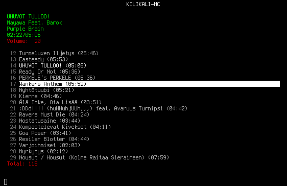
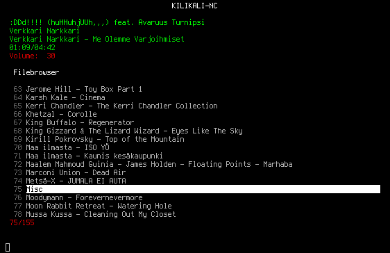

# Kilikali-NC

Simple NCurses UI audio player.

**Disclaimer**: This software is a work in progress. There remain some known bugs, but we are lazy developers.

## Screenshots

### Playlist mode

### Filebrowser mode

## Features

- NCurses UI with different modes
- Vim style key combinations by default
- Vim-like command mode
- Edit the playlist like a file in Vim by selecting, cutting and pasting lines
- Supports as many audio formats as GStreamer plugins do
- Supports local files and streams
- Supports pls and m3u playlist formats
- Downloads pls playlists for streams
- Supports m3u8 with gst-plugins-bad installed
- Configurable playlist line formatting
- Search with Posix regular expressions
- Special mode for C64 SIDs (https://github.com/kilikali-nc/gst-siddecfp)
- Able to fetch lyrics

## Requirements

- NCursesW
- Glib >= 2.68
- GStreamer 1.0 + plugins of your choise
- gst-plugins-base (ogg + rsid support. required by fpsid-decoder...)
- curl
- libmagic
- gettext
- UTF-8 Terminal

### Optional

- gst-plugins-good (flac, mp3...)
- gst-plugins-ugly (C64 SID...)
- gst-plugins-bad (m3u8...)

## Configuration

Default configuration file is located at ~/.config/kilikali-nc/default.cfg

How to generate new configuration file with default values: 'kilikali-nc -g config.cfg'

How to figure out key combinations for key configs: 'kilikali-nc -k'

See actual configuration file or man page for details.

kilikali-nc currently supports three button combinations. UTF-8 characters and
key-combinations with modifiers are supported. Example 1. "TTT" (press capital
t alone three times). Example 2. "^Txy" (press Ctrl and t, then alone x and finally
y alone)

## Usage

See doc/kilikali-nc.txt or man page.
